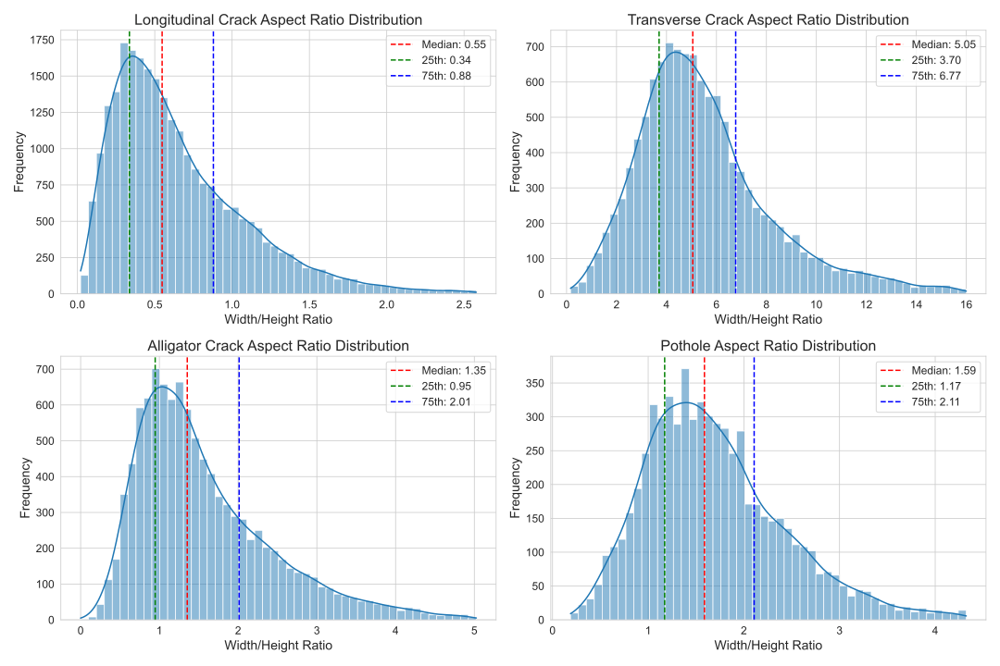
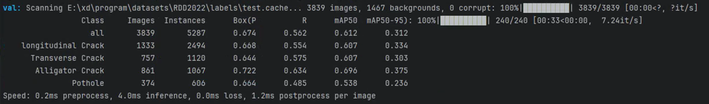
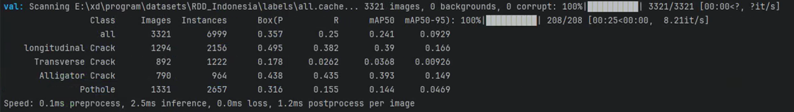

# OGFL-PavementDamage

**Orthogonal and Geometric Feature Learning for Pavement Damage Detection in Multi-Platform Imagery**


---

## 📋 Table of Contents

- [Introduction](#introduction)
- [Key Features](#key-features)
- [Performance](#performance)
- [Installation](#installation)
- [Datasets](#datasets)
- [Pre-trained Weights](#pre-trained-weights)
- [Quick Start](#quick-start)
- [Code Structure](#code-structure)
- [Reproducibility](#reproducibility)

---

## 🎯 Introduction

This repository provides the implementation of our direction-aware framework for pavement damage detection from multi-platform imagery (UAV aerial and vehicle-mounted cameras). Our method integrates directional information across three levels:

1. **Direction-aware Feature Enhancement (DFE)**: Orthogonal convolution branches (1×5, 5×1) capture horizontal and vertical crack patterns
2. **Direction-aware IoU Loss (DA-IoU)**: Aspect ratio-driven dynamic weighting for elongated crack detection
3. **Adaptive Shape Classification (ASC)**: Geometry-based priors for damage type discrimination

**Paper Status**: Under Review at *Case Studies in Construction Materials*

---

## ✨ Key Features

- ✅ **Direction-aware Feature Enhancement**: Explicit modeling of crack orientations
- ✅ **Aspect Ratio-aware Loss**:Weight distribution based on crack geometry
- ✅ **Cross-dataset Generalization**: 0.241 mAP50 on Indonesia (+2.1% over best baseline) and 0.612 mAP50 on RDD2022 (+4.1%)
- ✅ **Multi-platform Support**: Robust across UAV and ground-based imagery
- ✅ **Reproducible**: Core code and datasets provided

---

## 📊 Performance

### RDD2022 Test Set

| Method | mAP50 | D00 | D10 | D20 | D40 | Params | FLOPs |
|--------|-------|-----|-----|-----|-----|--------|-------|
| YOLOv8m | 0.588 | 0.576 | 0.597 | 0.684 | 0.514 | 25.9M | 78.7G |
| YOLOv10n | 0.519 | 0.520 | 0.504 | 0.660 | 0.392 | 2.7M | 8.2G |
| YOLOv11s | 0.596 | 0.599 | 0.592 | 0.698 | 0.493 | 9.4M | 21.3G |
| YOLOv12n | 0.554 | 0.558 | 0.537 | 0.686 | 0.433 | 2.6M | 6.3G |
| **Ours** | **0.612** | **0.607** | **0.607** | **0.696** | **0.538** | 21.86M | 75.5G |

*D00=Longitudinal, D10=Transverse, D20=Alligator, D40=Pothole*

### Indonesia Cross-dataset Evaluation

| Method | mAP50 | D00 | D10 | D20 | D40 | Recall | F1 |
|--------|-------|-----|-----|-----|-----|--------|-----|
| YOLOv8m | 0.17 | 0.394 | 0.041 | 0.359 | 0.151 | 0.249 | 0.293 |
| YOLOv10m | 0.177 | 0.305 | 0.039 | 0.271 | 0.094 | 0.202 | 0.243 |
| YOLOv11s | 0.216 | 0.333 | 0.029 | 0.359 | 0.142 | 0.232 | 0.275 |
| YOLOv12n | 0.211 | 0.344 | 0.031 | 0.332 | 0.138 | 0.231 | 0.285 |
| **Ours** | **0.241** | 0.39 | 0.037 | **0.393** | 0.144 | **0.25** | **0.294** |

**Key Highlights**:
- 🔥 **Best overall**: mAP50 = 0.241
- 🔥 **Best recall**: 0.25 (highest among all methods)

---

## 🛠️ Installation

### Requirements

- Python 3.11.8
- PyTorch 2.2.2
- CUDA 12.1
- GPU with ≥12GB memory (tested on RTX 4080)

### Step 1: Clone Repository
```bash
git clone https://github.com/yourusername/OGFL-PavementDamage.git
cd OGFL-PavementDamage
```

### Step 2: Create Environment
```bash
conda create -n ogfl python=3.11
conda activate ogfl
```

### Step 3: Install PyTorch
```bash
pip install torch==2.2.2 torchvision==0.17.2 --index-url https://download.pytorch.org/whl/cu121
```

### Step 4: Install Dependencies
```bash
pip install -r requirements.txt
```

### Step 5: Verify Installation
```bash
python -c "import torch; print(f'PyTorch: {torch.__version__}, CUDA: {torch.cuda.is_available()}')"
python -c "from ultralytics import YOLO; print('Ultralytics OK')"
```

---

## 📦 Datasets

### RDD2022 Dataset

**Source**: [RoadDamageDetector Official Repository](https://github.com/sekilab/RoadDamageDetector)

**Statistics**:
- Train: 26,336 images
- Val: 7,806 images  
- Test: 4,742 images
- Classes: D00 (Longitudinal), D10 (Transverse), D20 (Alligator), D40 (Pothole)

**Download**:
```bash
# Follow instructions at official repo
git clone https://github.com/sekilab/RoadDamageDetector.git
```

### Indonesia Dataset (Cross-dataset Evaluation)

A dataset collected from vehicle-captured dataset for evaluating cross-dataset generalization.

**Statistics**:
- Images: 3,321
- Instances: 6,999
- D00: 1,294 | D10: 892 | D20: 790 | D40: 1,331

**Download**: [Google Drive](https://drive.google.com/file/d/15u61F_3-kC0dfjXzyTM_2ccgicOXwb5d/view?usp=drive_link)

### RDD2022 Test Set (Our Split)

**Our test split** for reproducibility (since RDD2022 test labels are not public).

**Download**: [Google Drive](https://drive.google.com/file/d/1j-HDeqCRQ0-V_6jZClBpxgEeuWizaksg/view?usp=drive_link)

**Directory Structure**:
```
datasets/
├── rdd2022/
│   ├── train/images/ & labels/
│   ├── val/images/ & labels/
│   └── test/images/ & labels/
└── indonesia/
    ├── images/
    └── labels/
```

---

## ⚖️ Pre-trained Weights

### Our Models

| Model | Dataset | mAP50 | Download | Size |
|-------|---------|-------|----------|------|
| **Ours-Full** | RDD2022 | 0.612 | [Google Drive]() | 42.0MB |
| Baseline+CIoU | RDD2022 | 0.602 | [Google Drive](https://drive.google.com/file/d/18QN-r-IeuEIfEMX6snqLUvkXfBVSECH6/view?usp=drive_link) | 62.8MB |
| Baseline+DIoU | RDD2022 | 0.603 | [Google Drive](https://drive.google.com/file/d/1fOmCbC2q_h8T2esiPR-_cafslLrxRyuv/view?usp=drive_link) | 62.8MB |
| YOLOv8m | RDD2022 | 0.588 | [Google Drive]() | 49.6MB |
| YOLOv10n | RDD2022 | 0.532 | [Google Drive]() | 5.50MB |
| YOLOv11s | RDD2022 | 0.596 | [Google Drive]() | 18.3MB |
| YOLOv12n | RDD2022 | 0.591 | [Google Drive]() | 18.0MB |

### Download Instructions

**Option 1**: Click links above and place in `weights/` folder

**Option 2**: Use `gdown`
```bash
pip install gdown

# Download Ours-Full
gdown YOUR_FILE_ID -O weights/ours_full_rdd2022.pt

# Download baselines
gdown YOUR_FILE_ID -O weights/yolov8m_baseline.pt
```

---

## 🚀 Quick Start

### Inference
```bash
# Using Ultralytics YOLOv8 framework
from ultralytics import YOLO

# Load model
model = YOLO('weights/ours_full_rdd2022.pt')

# Predict
results = model.predict('path/to/image.jpg', conf=0.25)
results[0].show()
```

### Validation

**RDD2022 Test Set**:
```bash
yolo task=detect mode=val model=weights/ours_full_rdd2022.pt \
    data=datasets/rdd2022/rdd2022.yaml device=0
```

**Indonesia Dataset**:
```bash
yolo task=detect mode=val model=weights/ours_full_rdd2022.pt \
    data=datasets/indonesia/indonesia.yaml device=0
```

**Expected Output**:
```
Class     Images  Instances      P      R  mAP50  mAP50-95
  all       3839       5287  0.674  0.562  0.612     0.312
  D00       1333       2494  0.668  0.554  0.607     0.334
  D10        757       1120  0.644  0.575  0.607     0.303
  D20        861       1067  0.722  0.634  0.696     0.375
  D40        374        606  0.664  0.485  0.538     0.236
```

---

## 📁 Code Structure

### Repository Organization
```
OGFL-PavementDamage/
├── models/
│   └── direction.py           # ✅ DFE Module Implementation
├── utils/
│   ├── loss.py                # ✅ DA-IoU Loss Function
│   └── metrics.py             # ✅ Direction-aware IoU Metric
├── weights/                   # Pre-trained weights
├── assets/results/            # Validation screenshots & visualizations
└── requirements.txt           # Python dependencies
```

### Core Implementations

**1. Direction-aware Feature Enhancement (DFE)**

File: `models/direction.py`
```python
class DirectionFeatureEnhancement(nn.Module):
    """
    Orthogonal convolution branches for directional feature extraction.
    - Horizontal branch: 1×5 convolution (transverse cracks)
    - Vertical branch: 5×1 convolution (longitudinal cracks)
    - Channel attention: Adaptive fusion
    """
```

**Key Parameters**:
- `in_channels`: Input feature channels
- `reduction_ratio=4`: Channel reduction for efficiency
- Horizontal kernel: 1×5
- Vertical kernel: 5×1

**2. Direction-aware IoU Loss**

File: `utils/loss.py` + `utils/metrics.py`
```python
def direction_aware_iou(box1, box2, alpha_h=1.0, alpha_v=1.5, CIoU=True):
    """
    Aspect ratio-driven dynamic weighting for crack detection.
    - alpha_h=1.0: Weight for horizontal/transverse cracks
    - alpha_v=1.5: Weight for vertical/longitudinal cracks
    """
```

**Key Parameters**:
- `alpha_h=1.0`: Horizontal direction weight
- `alpha_v=1.5`: Vertical direction weight (optimized via grid search)
- `CIoU=True`: Use Complete IoU as base

**3. Adaptive Shape Classification (ASC)**

Integrated in: `utils/loss.py`


Shape priors based on RDD2022 aspect ratio statistics:
- D00 (Longitudinal): AR ≈ 0.55
- D10 (Transverse): AR ≈ 5.05
- D20 (Alligator): AR ≈ 1.35
- D40 (Pothole): AR ≈ 1.59

---

## 🔬 Integration with YOLOv8

### How to Use Our Modules
The implementation of our proposed modules, including the DFE (Direction Feature Enhancement) module, OGFL (Orientation-Guided Focal Loss), and all related utilities, will be made publicly available upon acceptance of this paper.

**Step 1**: Copy files to Ultralytics directory


**Step 2**: Modify YOLOv8 config


**Step 3**: Train with our framework


---

## 🔄 Reproducibility

### Hardware

- OS: Windows 10
- CPU: Intel Xeon Gold 6133 @ 2.50GHz
- GPU: NVIDIA RTX 4080 (16GB)
- RAM: 64GB

### Software

- Python: 3.11.8
- PyTorch: 2.2.2
- CUDA: 12.1
- Ultralytics: 8.1.0

### Training Configuration

| Parameter | Value |
|-----------|-------|
| Epochs | 200 |
| Batch Size | 32 |
| Image Size | 640×640 |
| Optimizer | SGD |
| Learning Rate | 0.01 |
| Momentum | 0.937 |
| Weight Decay | 0.0005 |
| αh | 1.0 |
| αv | 1.5 |
| Shape Loss Weight | 0.10 |

### Reproduce Paper Results
```bash
# 1. Train on RDD2022
yolo task=detect mode=train \
    model=configs/ogfl_full.yaml \
    data=datasets/rdd2022/rdd2022.yaml \
    epochs=200 batch=32 device=0

# 2. Evaluate on RDD2022 test
yolo task=detect mode=val \
    model=runs/train/exp/weights/best.pt \
    data=datasets/rdd2022/rdd2022.yaml

# 3. Cross-dataset evaluation on Indonesia
yolo task=detect mode=val \
    model=runs/train/exp/weights/best.pt \
    data=datasets/indonesia/indonesia.yaml
```

---

## 📸 Validation Screenshots

We provide validation screenshots to verify reproducibility:

### RDD2022 Test Set Validation



*Expected mAP50: 0.612*

### Indonesia Cross-dataset Validation



*Expected mAP50: 0.241*

### Qualitative Results

**Direction Misclassification Correction**:


*Shows cases where baseline misclassifies D00↔D10 while our method predicts correctly*

**Aspect Ratio Improvement**:


*Demonstrates 51% AR error reduction (29.5% → 14.0%)*

---

## 📄 License

This project is licensed under the MIT License - see [LICENSE](LICENSE) for details.

---
